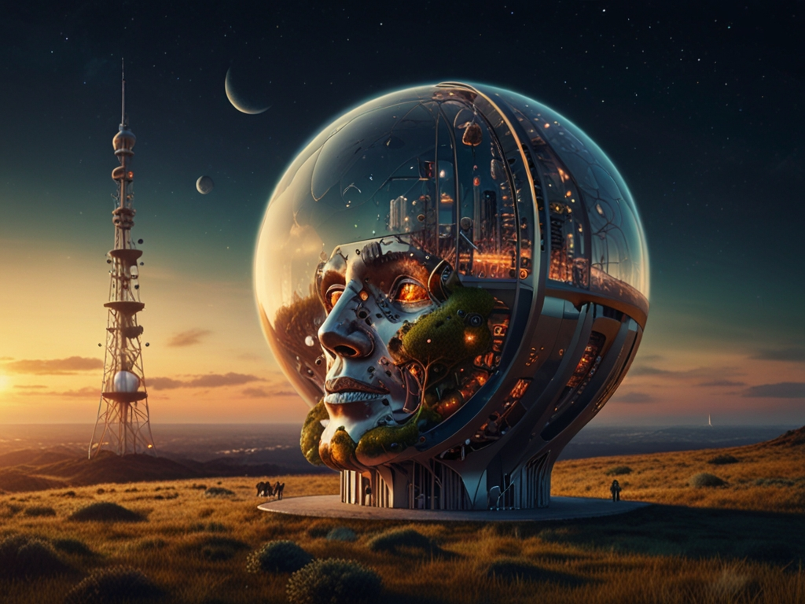

# Título: A Convergência Criativa: IA's Generativas e a Interseção com Outras Tecnologias

Nos últimos anos, testemunhamos uma aceleração extraordinária no **desenvolvimento de tecnologias disruptivas**. Entre elas, as ***Inteligências Artificiais (IA's) generativas emergem como protagonistas**** na fronteira da inovação. No entanto, sua influência não se limita apenas ao seu domínio original. Uma das tendências mais emocionantes é a **interseção das IA's generativas** com outras tecnologias transformadoras, como **Realidade Aumentada (AR), Realidade Virtual (VR) e Blockchain**.

## Realidade Aumentada (AR): O Mundo Amplificado pela Criatividade

**AR** revoluciona a forma como interagimos com o mundo digital, adicionando camadas virtuais ao ambiente físico. A ***fusão com IA's generativas*** oferece um potencial criativo sem precedentes. Imagine caminhar por uma galeria de arte onde as pinturas interagem com você, respondendo às suas expressões faciais ou até mesmo **criando obras de arte personalizadas com base em suas preferências**.

Além disso, a AR impulsiona a personalização em setores como varejo e publicidade. Com IA's generativas, os anúncios podem adaptar-se em tempo real às preferências do espectador, ***criando experiências imersivas e altamente envolventes***.

## Realidade Virtual (VR): O Universo da Experiência Imersiva

**VR transporta os usuários para mundos totalmente novos**, oferecendo experiências imersivas além da imaginação. Quando combinada com IA's generativas, essa tecnologia transcende os limites do possível. Desde ambientes virtuais gerados dinamicamente até personagens que aprendem e evoluem com base nas interações dos usuários, a ***convergência de VR e IA's generativas promete revolucionar jogos, simulações e treinamento profissional***.

Além disso, a ***VR potencializa a colaboração e a comunicação em um mundo cada vez mais globalizado***. Com IA's generativas, podemos criar avatares virtuais que não apenas replicam nossos movimentos e expressões, mas também aprendem e se adaptam às nuances de nossa personalidade, facilitando interações mais naturais e significativas.

## Blockchain: Descentralização e Criatividade Colaborativa

**Blockchain** é muito mais do que apenas a tecnologia por trás das criptomoedas. É um sistema descentralizado que promove ***transparência, segurança e confiança em diversas aplicações***. Quando combinado com IA's generativas, o **potencial é verdadeiramente revolucionário**.

Por meio de contratos inteligentes e tokens **não fungíveis** (NFTs), a blockchain permite a criação e autenticação de conteúdo digital único e escasso, desde obras de arte até músicas e vídeos. Com IA's generativas, podemos automatizar e personalizar a geração de conteúdo, permitindo novas formas de colaboração criativa e monetização justa para os artistas.

## Conclusão: O Futuro da Criatividade Tecnológica

A **interseção das IA's generativas com AR, VR e blockchain** é apenas o começo de uma revolução criativa que está moldando o futuro da tecnologia. À medida que essas tecnologias continuam a se fundir e evoluir, podemos esperar uma ***explosão de inovação*** em todas as áreas da vida humana, desde entretenimento e arte até educação e negócios.

No entanto, com esse potencial ilimitado vem a responsabilidade de garantir que essas tecnologias sejam utilizadas de forma ética e responsável. Devemos estar atentos aos desafios éticos e sociais que surgem, garantindo que a criatividade tecnológica seja um catalisador para um futuro mais inclusivo, justo e inspirador para todos.

Neste novo mundo de possibilidades infinitas, somos os arquitetos do amanhã, moldando um universo de criatividade sem limites com a interseção das IA's generativas e outras tecnologias transformadoras.

